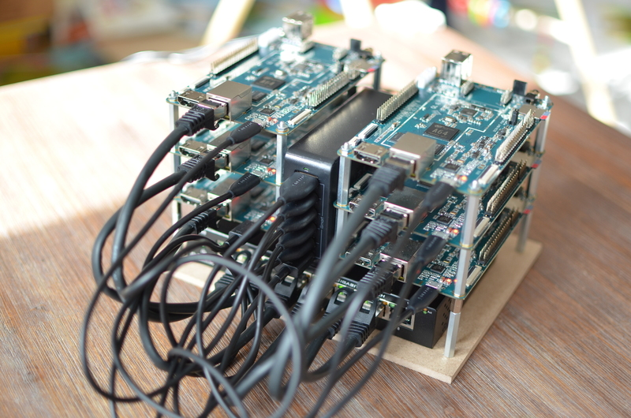

# Abstract
Why the heck should someone build a `Kubernetes (k8s) cluster` with six Pine64 when you can just use `Google Cloud`, `Amazon Web Services` or `Microsoft Azure`?

Of course, the answer is not that I ever want to create a cluster to be used as a production cluster. It is more the idea to create a relatively cheap cluster to play around with k8s and to see how k8s behaves if a node in the cluster fails. I also wanted to see how performant this cluster will be.

But to be very honest - I built it because I wanted to :)

In this article I will show you, why I have chosen the Pine64 as a compute engine, how we build it together step by step and what challenges we have been faced.

# Shopping List
## Compute engine
So first things first - yes, of course, we need a compute engine.

When I was looking for a suitable compute engine, I was looking for a compute engine that is cheap, has lots of 64-Bit cores, has lots of RAM, fast network connection, does not consume much energy and is small. Yes, this does not exist but the best trade-off I could find was a ``Pine64``.

The `Pine64` runs with an `Allwinner A64` that has a `1.152 GHz 64-bit quad-core ARM Cortex-A53` with `2GB DDR3 Memory`, a `1000Mbps Ethernet Port` a size of `133mm x 80mm x 19mm`, consumes `2.5 Watt` and that all for only `29$`. The Pine64 does not have a Wi-Fi module build in. If you need Wi-Fi, you have to buy the Wi-Fi 802.11BGN/BLUETOOTH 4.0 MODULE for 10$. But I don't need this. So, sounds like a fair deal for me.

The other candidate was the RaspberryPI 3. The biggest disadvantages are, 'only' 1GB memory (the Pine64 has 2GB), 'only' 100Mbps Ethernet Port (the Pine64 has 1000Mbps) and Raspbian runs only in 32-bit.

Shipping was from China so it took some weeks to be delivered to Germany and I had to pay some customs fees, but it was still ok.

## Other stuff
Of course, the shopping list does not stop here. You will also have to buy a `Switch`, a `USB Power Supply with min 2A per Pine64` and for each Pine64 an `SD Card`, `Micro B USB cable`, a `CAT.7 Ethernet Cable` and `30mm M3 Spacer` to stack all Pine64s together. I think 25mm should also work if you want to save some space.

I bought everything on Amazon and the spacers from Conrad.
## Complete List
<table style="width:100%">
  <tr>
    <th class="tg-hgcj">Article</th>
    <th class="tg-amwm">Price in EUR</th>
    <th class="tg-amwm">Qty</th>
    <th class="tg-amwm">Sum</th>
  </tr>
  <tr>
    <td class="tg-031e">Pine64</td>
    <td class="tg-lqy6">30,00 €</td>
    <td class="tg-lqy6">6</td>
    <td class="tg-lqy6">180,00 €</td>
  </tr>
  <tr>
    <td class="tg-yw4l">RAVPower 6-Port USB Power Supply 60W / 12A</td>
    <td class="tg-lqy6">23,00 €</td>
    <td class="tg-lqy6">1</td>
    <td class="tg-lqy6">23,00 €</td>
  </tr>
  <tr>
    <td class="tg-yw4l">TeckNet® [6-Pack] Premium 0.3m Micro USB Cable High Speed USB 2.0 A to Micro B</td>
    <td class="tg-lqy6">8,00 €</td>
    <td class="tg-lqy6">1</td>
    <td class="tg-lqy6">8,00 €</td>
  </tr>
  <tr>
    <td class="tg-yw4l">D-Link DGS-108/E 8-Port Layer2 Gigabit Switch</td>
    <td class="tg-lqy6">25,00 €</td>
    <td class="tg-lqy6">1</td>
    <td class="tg-lqy6">25,00 €</td>
  </tr>
  <tr>
    <td class="tg-yw4l">10x 0,25m CAT.7 Networ Cable 10000Mbit/s</td>
    <td class="tg-lqy6">15,00 €</td>
    <td class="tg-lqy6">1</td>
    <td class="tg-lqy6">15,00 €</td>
  </tr>
  <tr>
    <td class="tg-yw4l">SanDisk Ultra microSDHC 32GB up to 80 MB/Sec, Class 10</td>
    <td class="tg-lqy6">12,00 €</td>
    <td class="tg-lqy6">6</td>
    <td class="tg-lqy6">72,00 €</td>
  </tr>
  <tr>
    <td class="tg-yw4l">M3 Spacers</td>
    <td class="tg-lqy6">0,34 €</td>
    <td class="tg-lqy6">30</td>
    <td class="tg-lqy6">10,20 €</td>
  </tr>
  <tr>
    <td class="tg-yw4l"></td>
    <td class="tg-yw4l"></td>
    <td class="tg-yw4l">Total</td>
    <td class="tg-yw4l">333,20 €</td>
  </tr>
</table>

# Stick Together
I think one picture describes more than 1000 words;)

# Setup OS and Install Kubernetes
There are several steps to install a k8s cluster. One compute engine will run as the ``Kubernetes Master`` and the others will run as ``Kubernetes Nodes``, where the actual containers will run.

I decided to use an OS with a GUI for the master so we can plug a monitor and let Kubernetes Dashboard run. If you don't need this just download the Node image.

1. ``Download`` ``OS`` for Kubernetes ``Master`` and `Nodes`
2. ``Install`` ``OS`` on Kubernetes ``Master`` and ``each Node``
3. ``Install`` Kubernetes on ``Master`` and ``Nodes``using ``kubeadm``
4. Check installation

## Step 1: Download OS for Kubernetes
> Download script can be found here: https://github.com/rilleralle/k8s/blob/master/1-k8s-download.sh
### Master - Xubuntu Xenial Mate
Go to [http://wiki.pine64.org/index.php/Pine\_A64\_Software_Release](http://wiki.pine64.org/index.php/Pine_A64_Software_Release#Ubuntu_Desktop_Image_.5B20161215.5D_built_by_Pine64) `Ubuntu Desktop Image [20161215] built by Pine64` and download the `DD image (for 8GB micoSD card and above)` [Direct download from pine64.org](http://files.pine64.org/os/ubuntu/xubuntu-xenial-mate-20161215-longsleep-pine64-8GB.img.gz). If this link does not work please go to the Pine64 website.

### Node - Xenial Base Image
Go to [http://wiki.pine64.org/index.php/Pine\_A64\_Software_Release](http://wiki.pine64.org/index.php/Pine_A64_Software_Release#Xenial_Base_Image_.5B20161218-1.5D_by_longsleep) `Xenial Base Image [20161218-1] by longsleep` and download the `DD image (for 8GB micoSD card and above)` [Direct download from pine64.org](http://files.pine64.org/os/ubuntu/xenial-pine64-bspkernel-20161218-1.img.xz). `Please extract the compressed file`. If this link does not work please go to the Pine64 website.

## Step 2: Install OS on Master and Nodes using a Mac
I don't want any credits for the manual of how to install an image on an SD card using a Mac. I just copied the statements from the Raspberry Pi guys. They wrote an awesome howto! You can find it here:
https://www.raspberrypi.org/documentation/installation/installing-images/mac.md. You will also find howtos for Linux or Windows.

> Please be very careful with the `dd` tool. You can destroy your OS if you choose the wrong disk!

Unpack all SD cards, plug in to your computer and install OS with GUI on one SD and the headless version on the others.

<table style="width:100%">
  <tr>
    <th>Purpose</th>
    <th>Image name</th>
  </tr>
  <tr>
    <td>Master - with GUI</td>
    <td>xubuntu-xenial-mate-20161215-longsleep-pine64-8GB.img</td>
  </tr>
  <tr>
    <td>Nodes - headless</td>
    <td>xenial-pine64-bspkernel-20161218-1.img</td>
  </tr>
</table>

> Snippets file can be found here: https://github.com/rilleralle/k8s/blob/master/2-k8s-writeSD.txt

My SD card is located under **disk2**
```
$ diskutil list

/dev/disk2 (internal, physical):
#:TYPE NAME                 SIZE        IDENTIFIER
0:FDisk_partition_scheme    *31.9 GB    disk2
1:Windows_FAT_32 BOOT       52.4 MB     disk2s1
2:Linux                     31.8 GB     disk2s2
```
```
$ diskutil unmountDisk /dev/disk2

Unmount of all volumes on disk2 was successful
```
```
$ sudo dd bs=1m if=xubuntu-xenial-mate-20161215-longsleep-pine64-8GB.img of=/dev/rdisk2

Password:
#Grab a coffee! It will take some time. I had to wait for 5 minutes.

7392+0 records in
7392+0 records out
7751073792 bytes transferred in 290.547506 secs (26677475 bytes/sec)
```

```
$ sudo diskutil eject /dev/rdisk2

Password:
Disk /dev/rdisk2 ejected
```

Et voila, that was the SD card for the master. Please repeat for the other SD cards and use the correct image `xenial-pine64-bspkernel-20161218-1.img`. 

## Step 3: OS configuration 
### SSH to machine OR plug-in keyboard and monitor:
The credentials for both images are

* username: ubuntu
* password: ubuntu

### Become root
```
$ sudo su
```
### Change the hostname
```
$ hostnamectl set-hostname 'new-hostname'
```
Be creative!

### Setup static ip addresses
Kubernetes requires static ip addresses for master and nodes because the cluster does not work if the ip address changes after the installation.

You can bind a static ip address to an interface. All pines are connected via ethernet over the switch, so a gateway is not required.

Add the following lines to `/etc/network/interfaces`:
```
$ vi /etc/network/interfaces

auto eth0:0
allow-hotplug eth0:0
iface eth0:0 inet static
    address 192.168.11.1
    netmask 255.255.255.0
```
You can choose any address. I decided to use 192.168.11.1 for master and 192.168.11.2 - 6 for the nodes.

### (Only for Mate image) Disable NetworkManager
The NetworkManager is installed on the Ubuntu Mate image, that can cause problems with the static ip address. Disable the NetworkManager.
```
$ systemctl stop NetworkManager.service
$ systemctl disable NetworkManager.service
```
Check if you can ping the nodes from the master.

### Disable swap on the nodes
kubeadm join cannot be executed if swap is enabled.
Disable swap on OS start. Add the following line to /etc/rc.local before the exit 0 line.

```
$ vi /etc/rc.local
....
swapoff -a

exit 0
```
### Reboot the server
```
$ reboot
```

## Step 4: Install Kubernetes on every Pine64 
The guys from Kubernetes wrote a fantastic step-by-step manual how you install Kubernetes with kubeadm. If you follow my tutorial all you need is to execute the following commands. Please check the website if something is not working. The development of k8s is so fast, that this howto is maybe not up-to-date. https://kubernetes.io/docs/setup/independent/install-kubeadm/

> Please note, that the following commands from 0. - 3. needs to be executed on the ``master`` and also on ``every node``.

> Please start with the master, because we need a pod network installed on the master before we can join other nodes!

> Installation script can be found here: https://github.com/rilleralle/k8s/blob/master/3-k8s-install.sh

### 0. SSH to machine OR plug-in keyboard and monitor
The credentials for both images are

* username: ubuntu
* password: ubuntu


### 1. Become root:
```
sudo su -
```
### 2. Install docker:
```
apt-get update
apt-get install -y docker.io
```
### 3. Install kubelet, kubeadm, kubectl and kubernetes-cni:
```
apt-get update && apt-get install -y apt-transport-https
curl -s https://packages.cloud.google.com/apt/doc/apt-key.gpg | apt-key add -
cat <<EOF >/etc/apt/sources.list.d/kubernetes.list
deb http://apt.kubernetes.io/ kubernetes-xenial main
EOF
apt-get update
apt-get install -y kubelet kubeadm kubectl
```

> Please note, that the commands above have to be executed on the `master` and also on `every node`.

> The next steps who are indicated with `a)` needs to executed on the `master`.

> The other steps with ``b)`` needs to executed on the ``nodes``.

#### IF YOU ARE ON MASTER
##### 4a). Run kubeadm init command:
If everything works fine you will find a success message `Your Kubernetes master has initialized successfully!` and 3 other instructions. I will describe `Start your cluster`, `Deploy pod network` and `Join nodes` in the next chapters.
```
sudo kubeadm init --pod-network-cidr=10.244.0.0/16
```
The output looks like this:
```
Your Kubernetes master has initialized successfully!

To start using your cluster, you need to run (as a regular user):

  mkdir -p $HOME/.kube
  sudo cp -i /etc/kubernetes/admin.conf $HOME/.kube/config
  sudo chown $(id -u):$(id -g) $HOME/.kube/config

You should now deploy a pod network to the cluster.
Run "kubectl apply -f [podnetwork].yaml" with one of the options listed at:
  http://kubernetes.io/docs/admin/addons/

You can now join any number of machines by running the following on each node
as root:

  kubeadm join --token <token> <master-ip>:<master-port> --discovery-token-ca-cert-hash sha256:<hash>
```
##### 5a). Write down token

Kubeadm will print out the command, that needs to be executed on the nodes. The command will look like this:
```
kubeadm join --token <token> <master-ip>:<master-port>
```
##### 6a). Switch to normal user:
```
exit
```
##### 7a). Copy Kubernetes configuration to home folder so you can use `kubectl` without the argument --kubeconfig:
```
mkdir -p $HOME/.kube
sudo cp -i /etc/kubernetes/admin.conf $HOME/.kube/config
sudo chown $(id -u):$(id -g) $HOME/.kube/config
```
##### 8a). Deploy pod network:
> It is very important to install a pod network for ARM64! So, this statement downloads the flannel network, replaces the 'normal' amd64 with arm64 and creates the pod.

> VXLAN is not working on the Pine64. So exchange vxlan with udp.

```
curl -sSL "https://github.com/coreos/flannel/blob/master/Documentation/kube-flannel.yml?raw=true" | sed "s/amd64/arm64/g" | sed "s/vxlan/udp/g" | kubectl create -f -
```

##### 9a). Check installation:

Enter the following command to see the running pods:
```
sudo kubectl get pods --all-namespaces
```

Kubernetes Dashboard should be installed by default. If not, you can install it with this command:
```
curl -sSl "https://raw.githubusercontent.com/kubernetes/dashboard/master/src/deploy/recommended/kubernetes-dashboard-arm.yaml" | kubectl create -f - 
```

#### IF YOU ARE ON A NODE

##### 4b). Become root:
```
sudo su -
```

##### 5b). Join node to custer:

Now it is time to execute the command that was printed out on master after executing the ``kubeadm init`` command.
```
kubeadm join --token <token> <master-ip>:<master-port>
```

### Check installation on master
Enter the following command on the master to see the nodes:
```
kubectl get nodes
```
You should now see all nodes.

## Congratulations you can now call yourselves a proud owner of a Kubernetes Cluster! Wasn't that easy?!
